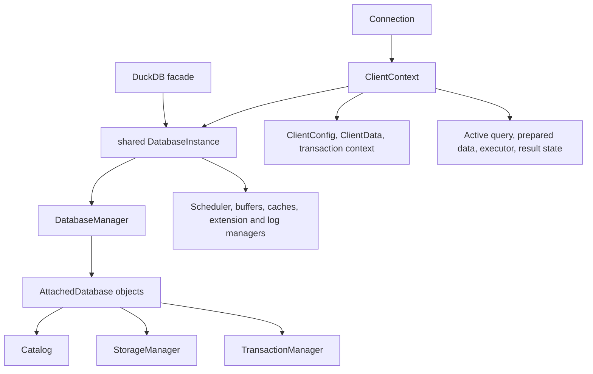

# Database runtime and session lifecycle

[Specification index](../README.md) · [Testing](../testing/README.md)

Source baseline: DuckDB `99063af2bd7092aff02e14184a20e24699d34d71` (2026-09-08). This document describes the C++ implementation; it does not assert that an equivalent Rust implementation exists. Source observations and additional engineering implications are distinguished below. Verification coverage describes available checks, not executed results.

## Ownership hierarchy

Ownership is not a literal tree in every case: shared references keep database and attachment state alive, and query results can retain context and external dependencies. Destruction order matters.

| Component | Responsibilities | Contract |
| --- | --- | --- |
| `DuckDB` | Convenience facade for database creation and access | Holds a shared `DatabaseInstance` |
| `DatabaseInstance` | Owns runtime-wide services and configuration | Shared by connections; tears down attachments and services in a controlled order |
| `DatabaseManager` | Tracks system, temporary, and attached databases | Resolves attachment identity and access to catalogs |
| `AttachedDatabase` | Represents a native or extension-backed database | Owns catalog, storage where applicable, and transaction manager; participates in close/checkpoint lifecycle |
| `Connection` | Internal C++ client entry point | Owns/retains a `ClientContext`; supports query, prepare, relation, and append operations |
| `ClientContext` | Coordinates parsing, planning, execution, transactions, and errors | Serializes context operations with its context lock; tracks the active query |
| `ClientConfig` / `ClientData` | Connection options, search path and session resources | Separate from database-global configuration |
| Prepared/query-result objects | Retain compiled state, results, and dependencies | Their lifetime can extend beyond the initiating API call |

Sources: [database.hpp](../../../duckdb/src/include/duckdb/main/database.hpp), [database.cpp](../../../duckdb/src/main/database.cpp), [attached_database.hpp](../../../duckdb/src/include/duckdb/main/attached_database.hpp), [client_context.hpp](../../../duckdb/src/include/duckdb/main/client_context.hpp), [connection.hpp](../../../duckdb/src/include/duckdb/main/connection.hpp).

## Initialization and shutdown

Database initialization establishes configuration, allocation and buffer services, the database manager, file-system access, scheduling, catalog contents, and extension integration. Persistent attachments load existing state and recover WAL as required. The default and explicitly loaded extensions register their functions and other capabilities with the runtime.

`DatabaseInstance` destruction resets attached databases before destroying scheduler and database-manager state. Logging remains available during early teardown, then the log manager is stopped before remaining buffer services are destroyed. Block allocation is flushed near the end. An extension retaining callbacks, buffers, or references must respect the lifetime of the corresponding runtime services.

## Query and result lifecycle

`ClientContext` starts query state, establishes transaction context and profiling, prepares the statement, creates the executor, and returns a pending, streaming, or materialized result according to the request and plan. Finishing a query cancels remaining tasks, clears progress/deadline state, and commits or rolls back an autocommit transaction. A commit error can become the result's error even after operator execution succeeded.

Streaming results retain live execution state. Fetch completion, cancellation, errors, and destruction are meaningful lifecycle events. Code must distinguish an API call that produced a result handle from a query that has successfully finished and committed.

Source: [client_context.cpp](../../../duckdb/src/main/client_context.cpp), especially `FetchResultInternal`, `CleanupInternal`, and `EndQueryInternal`; [pending](../../../duckdb/src/include/duckdb/main/pending_query_result.hpp), [streaming](../../../duckdb/src/include/duckdb/main/stream_query_result.hpp), and [materialized](../../../duckdb/src/include/duckdb/main/materialized_query_result.hpp) result interfaces.

## Session interface and state transitions

`ClientContext` is the coordination boundary, not a stateless SQL utility. Its public operations include `Query`, `PendingQuery`, `Prepare`, `BindStatement`, `IterateStatements`, `RunFunctionInTransaction`, and interruption. `Query` can process statement sequences; the string form of `PendingQuery` requires a single statement. `BindStatement` returns a `StatementSignature` containing result names/types, unordered parameter descriptors, and statement properties without optimizing or executing. The header explicitly promises that this binding operation does not disturb a live result. Consumers needing positional parameters must order descriptors by their binding index.

Statement iteration is distinct from executing a semicolon-split string. `PreprocessStatements` handles PRAGMA reparsing, multi-statement unpacking, and transaction wrapping. Consequently, clients should use the engine's iterator/preprocessing interfaces rather than reproduce SQL splitting or assume one parsed statement always becomes one execution unit.

The ordinary lifecycle is idle → prepare/bind → active execution → result consumption → query cleanup. These labels are an engineering description, not a published enum. A pending result exposes incremental progress; a streaming result keeps the active execution alive; a materialized result owns retained rows. Cleanup must occur on normal exhaustion, error, cancellation, and abandonment. Transactions and result lifetimes are related but not identical: an explicit transaction can span several queries, whereas autocommit completion belongs to the query lifecycle.

## Interruption, connection routing, and failures

Interruption uses atomic `ClientInterruptState`, an optional deadline, and `InterruptCheck`. The states distinguish ordinary execution, interruption, and suppressed interrupts. `SuppressInterrupts` is specifically intended after irreversible actions such as COMMIT; an implementation must not report cancellation as though an already committed operation had been rolled back.

This checkout also supports `ConnectToCatalog`/`DisconnectFromCatalog` for remote-style attached catalogs. Connected non-control SQL can route through a catalog-provided connect function. `IsConnected()` and `TryGetConnectedCatalog()` answer different questions: a detached target can leave the former true while the latter returns null. This routing path is an exception to a diagram that sends every SQL statement through the native planner and storage engine.

The context lock protects session coordination, not all database activity. Different connections can share a database and execute concurrently; parallel workers have separate execution state. Do not infer that arbitrary reentrant operations on one connection or concurrent mutation of a result object are safe because the database itself is multithreaded.

## Verification obligations

Changes here require lifecycle cases as well as SQL correctness: close a connection with live results, destroy pending work, interrupt during execution, exercise commit failure, use multiple connections, bind while a result is live, and detach a connected catalog. Cover native C++ and public handle ownership separately using the [component/API harnesses](../testing/component-api.md). The [transaction](transactions.md), [scheduler](scheduler.md), and [API](apis.md) specs define the downstream cleanup boundaries.
