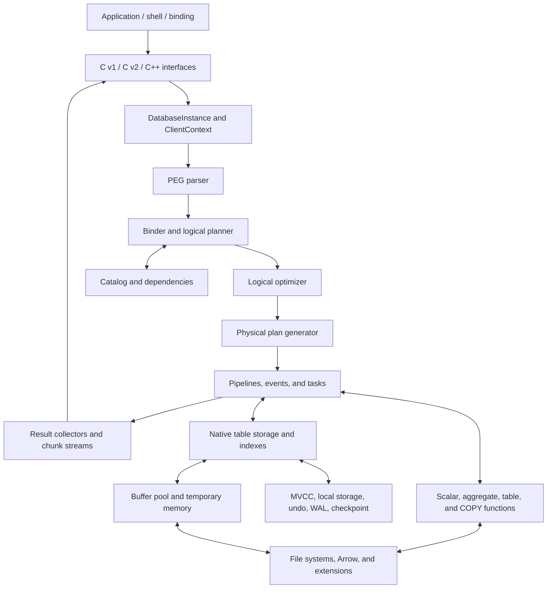

# System overview and baseline

[Specification index](README.md) · [Testing](testing/README.md)

Source baseline: DuckDB `99063af2bd7092aff02e14184a20e24699d34d71` (2026-09-08). This document describes the C++ implementation; it does not assert that an equivalent Rust implementation exists. Source observations and additional engineering implications are distinguished below. Verification coverage describes available checks, not executed results.

This is a descriptive engineering specification of the implementation in this checkout. It explains the database's components, their responsibilities and interfaces, the contracts that connect them, and the infrastructure used to verify them. It is intended for engineers navigating, extending, integrating, or independently evaluating this system.

The rewrite is governed by [principle #1: pluggable by construction](rewrite-principles.md#1-pluggable-by-construction). The implementation structure documented here is reference material, not a requirement to reproduce DuckDB's internal dependencies or concrete implementations.

| Property | Baseline |
| --- | --- |
| Repository | `duckdb/duckdb`, checked out under `ddb/duckdb` |
| Commit inspected | `99063af2bd7092aff02e14184a20e24699d34d71` |
| Commit date | 2026-09-08 |
| Commit subject | `Bump 10 extensions, remove 10 patches (#25449)` |
| Inspection date | 2026-09-08 |
| Method | Static inspection of source, headers, build definitions, harness implementations, test corpora, and CI workflows |
| Validation status | Documentation and source references checked; no database build, test suite, benchmark, or external CI run performed for this specification |

The scope includes all first-party engine components and all identifiable first-party test-harness families present in the checkout, including their integration with external suites. It does not reproduce every SQL production, exported function, test case, compression bit layout, or vendored dependency implementation. The linked headers, declarative API specifications, grammar, serialization schemas, and test files provide those exhaustive details.

The adjacent `ddb/duckdb-rust` repository hosts this specification set but has no Rust database implementation at inspection time. It contributes no engine or harness implementation to the system described here. Python, R, JDBC, Node.js, Go, and Wasm client implementations must not be inferred from older DuckDB directory descriptions: their full implementations are not in this checkout's `tools/` tree. Some are exercised through external CI integrations.

Implementation and build files take precedence over historical documentation. In particular, [src/README.md](../../duckdb/src/README.md) still describes a PostgreSQL parser, while [parser.cpp](../../duckdb/src/parser/parser.cpp) uses DuckDB's PEG implementation. [AGENTS.md](../../duckdb/AGENTS.md) also contains some historical paths, including a physical-plan generator path and Python package directory that do not match this tree.

DuckDB is an embedded analytical database implemented primarily in C++. An application creates a database instance and one or more connections in its own process. SQL compilation, vector execution, storage access, transaction processing, and extension execution occur within that process. The shell is one client of the library; it is not the engine's required host.

The engine can query native tables, temporary data, table-function outputs, and external data exposed by extensions. A native database can be memory-resident or persistent. Attached databases can provide alternative catalog and transaction implementations through storage extensions. This tree does not establish a built-in distributed execution cluster, replication service, or network SQL server.

## Source-tree inventory

Counts below are tracked files at the baseline commit, not compiled translation units or executed tests.

| Directory | Tracked files | Responsibility |
| --- | ---: | --- |
| [src](../../duckdb/src/) | 3,423 | Engine implementations, internal interfaces, generated and public headers |
| [extension](../../duckdb/extension/) | 1,263 | In-tree extension implementations and extension build machinery |
| [test](../../duckdb/test/) | 6,204 | Native runner, component tests, SQL regressions, fixtures, configuration, specialized harnesses |
| [benchmark](../../duckdb/benchmark/) | 1,922 | Benchmark runner, workloads, SQL, expected results, supporting assets |
| [tools](../../duckdb/tools/) | 170 | Shell, C++ wrapper, Swift binding, plan utility, Python shell/runner tests |
| [scripts](../../duckdb/scripts/) | 134 | Generators, formatting, packaging, CI orchestration, compatibility and regression tools |
| [api_spec](../../duckdb/api_spec/) | 74 | Declarative v1/v2 C API specifications and generation environment |
| [.github](../../duckdb/.github/) | 166 | Workflows, extension configurations and patches, repository automation |
| [third_party](../../duckdb/third_party/) | 659 | Vendored libraries; their presence is not evidence that their own upstream suites are run |

## Core component map

| Implementation | Main abstraction | Inputs and outputs | Principal dependencies |
| --- | --- | --- | --- |
| [src/main](../../duckdb/src/main/) | `DatabaseInstance`, `ClientContext`, `Connection` | Configuration/SQL/API requests → sessions, plans, results | All engine services |
| [src/parser](../../duckdb/src/parser/) | `Parser`, `SQLStatement`, PEG grammar and transformers | SQL text → parsed syntax objects | Tokenizers, grammar cache, parser extensions |
| [src/planner](../../duckdb/src/planner/) | `Planner`, `Binder`, `LogicalOperator`, bound `Expression` | Syntax and catalog → typed logical plan | Catalog, type/function binding, transactions |
| [src/optimizer](../../duckdb/src/optimizer/) | `Optimizer`, transformation passes | Logical plan → equivalent optimized plan | Statistics, binding identities, function properties |
| [src/execution](../../duckdb/src/execution/) | `PhysicalPlanGenerator`, `PhysicalOperator`, `ExpressionExecutor` | Logical plan/chunks → physical plan/chunks | Functions, storage, collections, parallel execution |
| [src/parallel](../../duckdb/src/parallel/) | `Executor`, `Pipeline`, `MetaPipeline`, `Event`, `TaskScheduler` | Physical plan → scheduled work and completion | Operator state, thread contexts, interrupts |
| [src/catalog](../../duckdb/src/catalog/) | `Catalog`, `CatalogSet`, `CatalogEntry`, dependency manager | Names and DDL → transaction-visible metadata | Transactions, storage, extension catalogs |
| [src/transaction](../../duckdb/src/transaction/) | `MetaTransaction`, `DuckTransaction`, `UndoBuffer` | Read/write activity → visibility, commit, rollback | Catalog versions, local storage, WAL/checkpoint |
| [src/storage](../../duckdb/src/storage/) | `DataTable`, `RowGroup`, storage and buffer managers | Logical table operations ↔ blocks, segments, WAL | Compression, files, memory, transaction visibility |
| [src/function](../../duckdb/src/function/) | Function descriptors and callbacks | Typed arguments/chunks → values, aggregates, scans, writes | Catalog registration, execution, I/O |
| [src/common](../../duckdb/src/common/) | Types, vectors, allocators, serializers, file systems | Shared representation and service interfaces | Selected vendored libraries, OS services |
| [src/logging](../../duckdb/src/logging/) | Log manager, loggers, log storage | Structured events → configured storage/output | Runtime contexts and registered log types |

## Limits and maintenance of this specification

This specification set is comprehensive at component, interface-family and harness-family level. It is not a formal proof, a byte-for-byte storage format standard, a complete SQL reference, or a statement that the baseline passes all tests. No runtime results were collected for this documentation task.

The inventory distinguishes source-present, build-registered and externally supplied components. External extension sources, downloaded SQLite suites, historical BWC assets, external actions, installed Python packages and platform SDKs expand the runnable system beyond a fresh checkout. Their actual revisions and availability must be recorded in any execution report.

Known documentation/integration qualifications discovered while mapping the tree are material:

- The old source README's PostgreSQL-parser description is stale; PEG is the implementation here.
- Historical paths for the physical-plan generator, Python package and parallel CSV harness do not match this tree.
- The old Make SQLSmith executable path is not backed by an in-tree target here; configured SQLSmith is external.
- Root `make generate-files` and the separate C v2 generator have different entry points.
- `test/configs/io_metrics.json` has a specialized schema; a directory-wide JSON sweep is invalid.
- The I/O harness records known-wrong metrics as skips, and some verification configs explicitly exclude tests.
- The memory-growth supervisor and tag validator have operational/reporting limitations described in their sections.
- C v2/default storage version constants and wrapper labels do not independently establish published release guarantees.

To update this specification, first refresh the commit and tracked-file inventory, then check component ownership/signatures, generated API/storage definitions, test CMake registration, configuration groups and workflow entry points. Verify every linked path after structural changes. Keep observations about unexecuted checks separate from actual build/test evidence.
