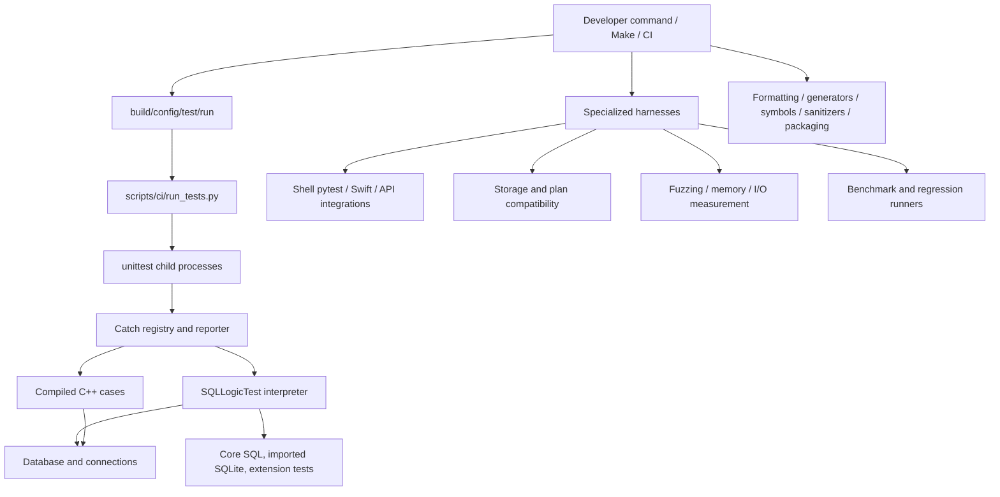

# Testing architecture and harness index

[Specification index](../README.md) · [System overview](../overview.md)

Source baseline: DuckDB `99063af2bd7092aff02e14184a20e24699d34d71` (2026-09-08). This document describes the C++ implementation; it does not assert that an equivalent Rust implementation exists. Source observations and additional engineering implications are distinguished below. Verification coverage describes available checks, not executed results.

The repository has a native correctness runner, a process orchestration layer, specialized independent harnesses, and CI/build gates. A test corpus is an input to a harness; it is not a separate runner merely because it has its own directory.

The rewrite now has an explicit [full test parity and zero-regression acceptance
requirement](parity.md). The source inventory below does not establish that goal.

For the rewrite, [principle #1: pluggable by construction](../rewrite-principles.md#1-pluggable-by-construction) requires shared interface-conformance suites for built-in and alternative adapters, plus configurable fuzzing, fault-injection, and benchmark harnesses. This requirement guides future verification design; the inventory below describes existing DuckDB harnesses, not completed rewrite tests.

The separate [rewrite workload conformance specification](rewrite-workloads.md) adds future verification requirements for format interchange, OLAP preservation, OLTP, graph, random access, and mixed workloads. It is not part of the source-baseline harness register below and does not claim those capabilities are implemented.

## Detailed harness specifications

| Document | Harness register coverage | Interface and oracle focus |
| --- | --- | --- |
| [Native runner](native-runner.md) | T01 | Startup, discovery, Catch registration, reporting and cleanup |
| [SQLLogicTest](sqllogictest.md) | T02 | Script state, directives, SQL/results/errors, normalization and skips |
| [Process orchestration](orchestration.md) | T03 | Listing, batching, subprocesses, timeouts, retries and reproducers |
| [Configuration and isolation](configuration.md) | T04 | Verification matrices, precedence, environment and scratch ownership |
| [Component/API/extension tests](component-api.md) | T05–T07, T29 | Native fixtures, ADBC loading, callbacks and metadata scenarios |
| [Client and harness contract tests](clients.md) | T08–T12, T26 | Shell/Swift, stdin, directory lifecycle, tags and infrastructure tests |
| [Fuzzers and replay](fuzzer.md) | T13–T14, storage part of T16 | Byte targets, external generators, reductions, checksums and injected faults |
| [Stress and instrumentation](stress.md) | T15–T17 | RSS growth, persistence/recovery, initialization and sanitizers |
| [Independent I/O metrics](io-metrics.md) | T18 | Interposition shim versus reported query byte counters |
| [Compatibility and artifacts](compatibility.md) | T19–T21, ABI/package parts of T27, T30 | Historical storage/plans, API layout, signatures and package boundaries |
| [Benchmarks and regressions](benchmarks.md) | T22–T24 | Workload lifecycle, result verification and baseline/current measurement |
| [Build gates and CI](ci.md) | T25–T28 and workflow integration | Parser utilities, generators, compilation, symbols and selected external jobs |
| [Execution runbook](runbook.md) | Cross-cutting | Commands, prerequisites, safe scope and reproducible artifacts |
| [Coverage matrix](coverage.md) | Cross-cutting | Component change → relevant correctness/failure checks |

The register below is an inventory of mechanisms, not a claim that all 30 are independent executables or all run in every build. Native cases and SQL corpora share runners; specialized tools can have external binary, package, platform or service prerequisites.

## Harness register

| ID | Harness or verification mechanism | Owner/entry point | Principal oracle and scope |
| --- | --- | --- | --- |
| T01 | Native Catch test executable | [test/unittest.cpp](../../../duckdb/test/unittest.cpp) | Assertions and exit status for compiled cases and registered SQL cases |
| T02 | SQLLogicTest interpreter | [test/sqlite](../../../duckdb/test/sqlite/) | Expected statement success/error, result values/hashes, script control flow |
| T03 | Parallel test orchestrator | [scripts/ci/run_tests.py](../../../duckdb/scripts/ci/run_tests.py) | Child outcomes, timeout/crash detection, retries, configuration sweeps and diagnostics |
| T04 | Runtime verification/configuration sweeps | [test/configs](../../../duckdb/test/configs/), [Makefile](../../../duckdb/Makefile) | Alternate plans/representations/storage modes preserve behavior |
| T05 | Native C v1/v2, C++ and Arrow tests | [test/api](../../../duckdb/test/api/), [test/arrow](../../../duckdb/test/arrow/), [tools/cpp/tests](../../../duckdb/tools/cpp/tests/) | API contract, lifecycle, type/data round-trip, callbacks, failure behavior |
| T06 | ADBC driver tests | [test/api/adbc](../../../duckdb/test/api/adbc/) | Driver loading, statement execution, Arrow and ingest behavior |
| T07 | Loadable/static extension test fixtures | [test/extension/CMakeLists.txt](../../../duckdb/test/extension/CMakeLists.txt) | Initialization, dispatch, failure propagation, registration and compatibility |
| T08 | Shell pytest suite | [tools/shell/tests](../../../duckdb/tools/shell/tests/) | Process output/status and shell-specific behavior |
| T09 | SQL runner stdin pytest | [tools/sqllogic/tests](../../../duckdb/tools/sqllogic/tests/) | Native runner behavior with streamed SQLLogicTest input |
| T10 | Test-directory lifecycle pytest | [test/py/test_temp_dir_contract.py](../../../duckdb/test/py/test_temp_dir_contract.py) | Filesystem state after process success/failure and option validation |
| T11 | SQL tag-selection validator | [validate_tags_usage.sh](../../../duckdb/test/sqlite/validate_tags_usage.sh) | Selected/omitted fixture statements; shell diagnostic assertions |
| T12 | Swift/Xcode tests | [Swift tests](../../../duckdb/tools/swift/duckdb-swift/Tests/DuckDBTests/), [workflow](../../../duckdb/.github/workflows/Swift.yml) | Swift API and conversions on selected Apple platforms |
| T13 | OSS-Fuzz native targets and replay | [test/ossfuzz](../../../duckdb/test/ossfuzz/), [cifuzz workflow](../../../duckdb/.github/workflows/cifuzz.yml) | Sanitizer/crash behavior and replayed internal-error checks |
| T14 | Generated SQL/fuzzer regressions | [test/fuzzer](../../../duckdb/test/fuzzer/), [SQLSmith configuration](../../../duckdb/.github/config/extensions/sqlsmith.cmake) | Reduced historical failures via T02; active generator supplied externally |
| T15 | Long-running memory-growth harness | [test_memory_leaks.py](../../../duckdb/test/memoryleak/test_memory_leaks.py) | RSS stabilization during repeated object/query lifecycles |
| T16 | Persistence/crash and storage operation/fault tests | [test/persistence](../../../duckdb/test/persistence/), [storage fuzz test](../../../duckdb/test/common/test_storage_fuzz.cpp) | Recovery/robustness assertions in the native runner |
| T17 | Storage initialization comparison | [test_zero_initialize.py](../../../duckdb/scripts/test_zero_initialize.py) | Compare files produced under different initialization patterns |
| T18 | Independent I/O metrics harness | [run_io_metrics_test.py](../../../duckdb/test/io_metrics/run_io_metrics_test.py) | Profiled byte counts versus intercepted actual file I/O |
| T19 | Storage compatibility runner | [test_storage_compatibility.py](../../../duckdb/scripts/test_storage_compatibility.py) | Current test-generated databases against selected older CLI versions |
| T20 | Plan backward-compatibility runner/cache | [test/bwc/runner.py](../../../duckdb/test/bwc/runner.py) | Old serialized plans/results versus new-engine execution |
| T21 | Earlier plan serialization harness | [test_serialization_bwc.py](../../../duckdb/scripts/test_serialization_bwc.py), [plan_serializer](../../../duckdb/tools/utils/plan_serializer.cpp) | Two-checkout plan serialization/deserialization testing |
| T22 | Native/interpreted benchmark runner | [benchmark](../../../duckdb/benchmark/) | Workload verification, timings, timeout and profiling |
| T23 | SQL benchmark smoke harness | [test_benchmark_sql_runner.py](../../../duckdb/scripts/test_benchmark_sql_runner.py) | Setup/query subprocesses succeed; catches crashes/errors |
| T24 | Performance, size and plan-cost regression tools | [scripts/regression](../../../duckdb/scripts/regression/), related `regression_*` scripts | Baseline/current measurements and configured regression thresholds |
| T25 | Parser corpus utilities | [test_peg_parser.py](../../../duckdb/scripts/test_peg_parser.py), [parser_test.py](../../../duckdb/scripts/parser_test.py) | Parser/corpus diagnostics using external SQLLogicTest Python packages |
| T26 | CI/packaging/regression tool self-tests | [scripts/ci/test_*.py](../../../duckdb/scripts/ci/), [regression tests](../../../duckdb/scripts/regression/) | Python unit-test assertions for infrastructure itself |
| T27 | Source/build/API/ABI/static-analysis gates | [Makefile](../../../duckdb/Makefile), [.github/workflows](../../../duckdb/.github/workflows/) | Format/generation drift, compiler/linker failures, symbols, ABI and analysis findings |
| T28 | External client/extension/Wasm integration workflows | [_extension_client_tests.yml](../../../duckdb/.github/workflows/_extension_client_tests.yml), other platform workflows | Tests executed in external projects or generated packages |
| T29 | Extension update/metadata scenario builder | [run_extension_medata_tests.sh](../../../duckdb/scripts/run_extension_medata_tests.sh) | Built version/platform mismatch scenarios, repositories and SQL update/install assertions |
| T30 | Signed-extension verifier | [verify-extension-signing.sh](../../../duckdb/scripts/verify-extension-signing.sh) | Verify artifact signature footers against the supplied public key |

## Corpus inventory

Under `test/`, the baseline has 4,846 `.test` files and 791 `.test_slow` files, totaling 5,637 SQLLogicTest files. There are no tracked `.test_coverage` files there, although the runner recognizes that suffix. It also has 233 `.cpp` files, including harness code, helpers and native fuzz targets; this is not a count of compiled test cases.

| SQL corpus directory | `.test` + `.test_slow` files | Coverage |
| --- | ---: | --- |
| [test/sql](../../../duckdb/test/sql/) | 4,792 | Main SQL/function/storage/transaction/execution regression corpus |
| [test/fuzzer](../../../duckdb/test/fuzzer/) | 283 | Reduced generated/fuzz failures |
| [test/issues](../../../duckdb/test/issues/) | 233 | Historical issue regressions |
| [test/optimizer](../../../duckdb/test/optimizer/) | 200 | Optimizer and statistics regressions |
| [test/parquet](../../../duckdb/test/parquet/) | 68 | Parquet format and interoperability regressions |
| [test/extension](../../../duckdb/test/extension/) | 33 | Extension behavior |
| [test/geoparquet](../../../duckdb/test/geoparquet/) | 8 | GeoParquet cases |
| [test/sqlite](../../../duckdb/test/sqlite/) | 8 | Retained SQLite-style cases and tag fixtures |
| [test/common](../../../duckdb/test/common/) | 3 | Common value/cast/path behavior |
| [test/db-benchmark](../../../duckdb/test/db-benchmark/) | 2 | Benchmark-derived SQL correctness |
| [test/logging](../../../duckdb/test/logging/) | 2 | Logging behavior |
| [test/sqlserver](../../../duckdb/test/sqlserver/) | 2 | Imported/derived SQL compatibility cases |
| [test/ldbc](../../../duckdb/test/ldbc/) | 1 | LDBC-derived query coverage |
| [test/planner](../../../duckdb/test/planner/) | 1 | Planner regression |
| [test/sakila](../../../duckdb/test/sakila/) | 1 | Sample-database workload |

The corpus includes DDL/alter/catalog, attach/connect, parameters and prepared statements, expressions/casts/types/variant, joins/subqueries/CTEs, aggregates/windows, sorting/limits/Top-N, DML/merge/upsert/returning/triggers, indexes/constraints, CSV/COPY/JSON/Parquet, storage versions/encryption, parallelism/out-of-core execution, settings/secrets and profiling. [test/sql](../../../duckdb/test/sql/) is the authoritative directory taxonomy.

Fixtures additionally live under [data](../../../duckdb/data/) and specialized test directories. Fixture-generation scripts such as [generate_parquet_test.py](../../../duckdb/test/parquet/generate_parquet_test.py), [generate_tpcds_results.py](../../../duckdb/scripts/generate_tpcds_results.py), and CSV/data helpers produce inputs or expected results. Generation is not an independent correctness verdict: newly generated expected results require validation of their origin.
